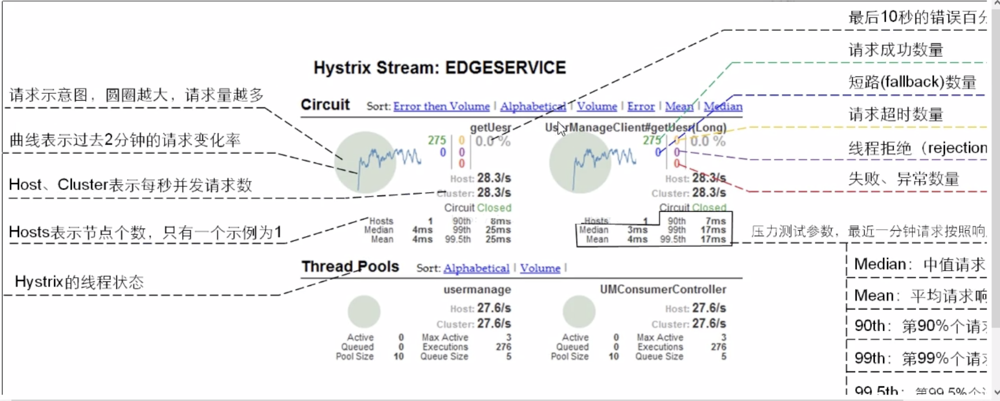
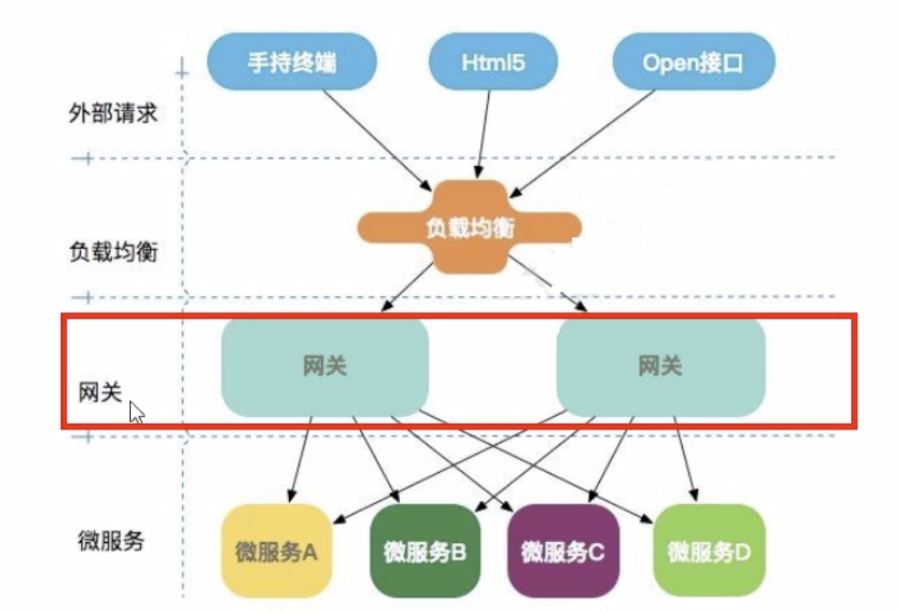
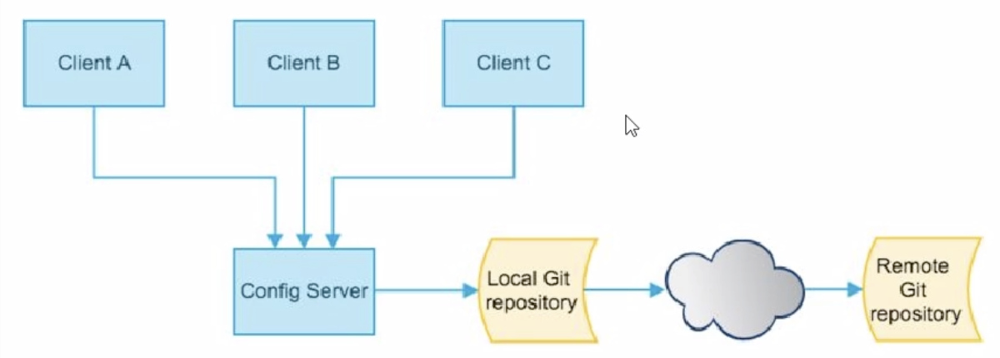
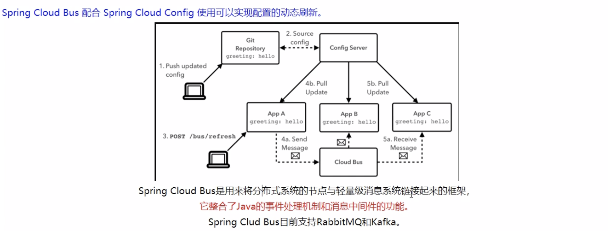
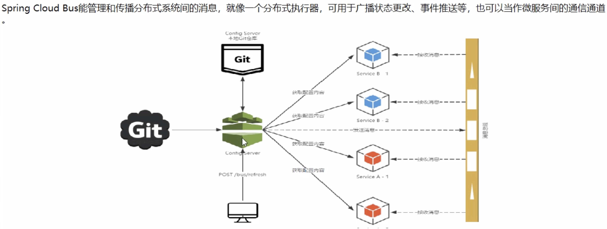
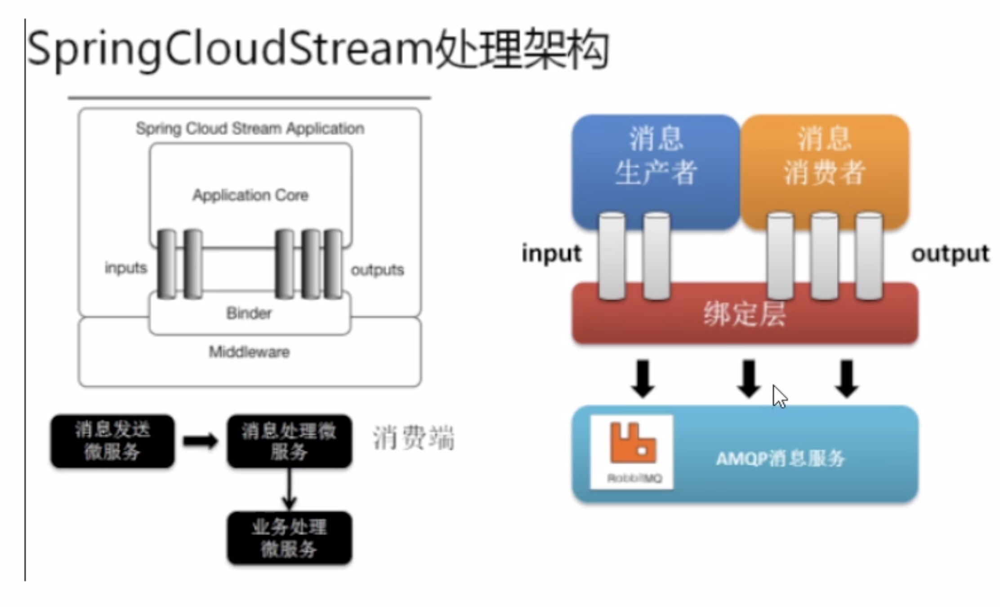
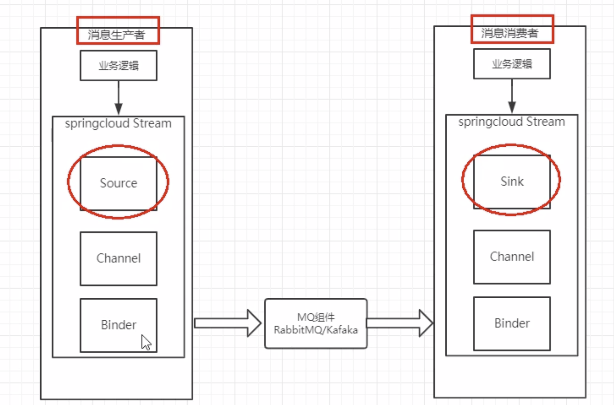

# springCloud学习


## <center>服务调用2</center>

### 1、feign（假装）❌
* 是什么👻：服务提供端的负载均衡，服务调用端只需创建一个借口，添加注解，即可实现

* 为什么要用


### 2、openFeign✅
例[cloud-consumer-consul-feign-order1400](./cloud-consumer-consul-feign-order1400/)

* feign的区别


	#### openFeign使用
	
	1. pmo.xml
		
		```
		 <!--openFeign-->
	        <dependency>
	            <groupId>org.springframework.cloud</groupId>
	            <artifactId>spring-cloud-starter-openfeign</artifactId>
	        </dependency>
		```
	2. application.properties

		```
		spring.main.allow-bean-definition-overriding=true
		```

	
	3. 主启动类
		* 服务调用端 添加@EnableFeignClients
		
			```
			@EnableFeignClients		// 使用该注解启用openFeign
			```
	4. 业务类
		* 定义一个接口
			
			```
			@Component
			@FeignClient(value = "cloud-provider-consul-payment")   //要用OpenFeign负载均衡的服务
			public interface PaymentFeignService {
			
			    @GetMapping("/getport")  // 具体服务的接口
			    String getPort();
			
			    @GetMapping("/timoutTest/{ms}")
			    String timoutTest(@PathVariable("ms")int ms);
			}
			```
	
	#### openFeign服务调用超时设置
	```
	# 修改feign服务调用默认超时时间
	feign.client.config.default.connect-timeout=3000
	feign.client.config.default.read-timeout=3000
	```
	
	#### openFeign服务调用详细日志打印
	1. 日志级别
		* NONE 默认的不显示任何日志
		* BASIC 仅记录请求方法、URL、响应状态码及执行时间
		* HEADERS 显示BASIC和请求和响应头信息
		* FULL 显示HEADERS和请求正文及元数据

	2. 使用
	
		* 编写一个class， 
		
		```
		@Configuration
		public class FeignConfig {
		
		    // 设置openfeign日志级别
		    @Bean
		    Logger.Level feignLoggerLevel(){
		        return Logger.Level.FULL;
		    }
		}
		```
		* application.properties 文件中
		
		```
		# 配置 openFeign日志 以什么级别 监控 哪个接口
logging.level.com.cl.springcloud.service.PaymentFeignService:debug
		```
		
## <center>服务降级与熔断</center>

* 作用，避免因服务调用串中某个服务异常而导致整个系统等待，进而发生雪崩

**重要概念**

* 服务降级 当服务器压力剧增的情况下，根据当前业务情况及流量**对一些服务和页面有策略的降级**，以此释放服务器资源以保证核心任务的正常运行
* 服务熔断 如果某个目标服务调用慢或者有大量超时，此时，**熔断该服务的调用**，对于后续调用请求，不在继续调用目标服务，直接返回，快速释放资源。如果目标服务情况好转则恢复调用
* 服务限流 flowlimit 高并发时，只允许特定数量的请求访问


### 1、Hystrix⚠️
* Hystrix是一个开源库，用于处理分布式系统的**延时**和**容错**
* 断路器熔断器，调用某个服务出故障时，向调用方返回一个符合预期的可处理的备选响应(FallBack)，而不是长时间的等待货抛出调用方无法处理的异常


**Hystrix 使用-服务降级**

* **调用端，配合openFeign**

	例[cloud-consumer-consul-feign-hystrix-order1500](./cloud-consumer-consul-feign-hystrix-order1500)

	1、application.properties 文件
	
	```
	# 启用feign中的服务降级功能
	feign.hystrix.enabled=true
	```
	
	2、主启动类
	
	```
	@EnableHystrix          // 启用Hystrix
	```
	
	3、调用端service接口
	
	```
	@Component
	@FeignClient(value = "cloud-provider-consul-hystrix-payment", fallback = Service15Impl.class) // 使用Feign进行服务调用，并指定fallback实现类，
	public interface Service15 {
	    ...
	}
	
	// Service15Impl继承Service15，并重写其方法，作为fallback方法
	@Component
	public class Service15Impl implements Service15{
		...
   }
	```
	
* **用于被调用端**

	例[cloud-provider-consul-hystrix-payment1501](./cloud-provider-consul-hystrix-payment1501)

	1、主启动类，添加注解
	
	```
	@EnableCircuitBreaker   // 启用服务降级功能
	```

	2、向需要降级的类添加注解
	
	```
	@DefaultProperties(defaultFallback = "c1_defaultFallback") //配置该类的默认全局defaultFallback方法
	```
	
	3、 向需要降级的方法添加注解

	```
	@HystrixCommand //不指定，使用全局默认
	```
	
	4、可单独对某些方法做特定指定
	
	```
	@HystrixCommand(
            fallbackMethod = "getPort2_fallbackMethod",
            commandProperties = {
                    @HystrixProperty(name = "execution.isolation.thread.timeoutInMilliseconds", value = "3000") //若超过3s，则调用fallbackMethod方法
            }
    ) //若该方法故障，用哪个方法catch
	```
	
**Hystrix 使用-服务熔断**

例[cloud-provider-consul-hystrix-payment1501](./cloud-provider-consul-hystrix-payment1501)

```
	 /**
     * 超时，指定异常处理
     * 服务熔断，在服务降级的基础上，添加降级条件和恢复条件
     * @return
     */
    @RequestMapping("/getPort3/{id}")
    @HystrixCommand(
            fallbackMethod = "getPort3_fallbackMethod",
            commandProperties = {
                    @HystrixProperty(name = "execution.isolation.thread.timeoutInMilliseconds", value = "100"),
                    @HystrixProperty(name = "circuitBreaker.enabled", value = "true"),    //启用熔断功能
                    @HystrixProperty(name = "circuitBreaker.requestVolumeThreshold", value = "10"),    // 检查的请求次数
                    @HystrixProperty(name = "circuitBreaker.sleepWindowInMilliseconds", value = "10000"),    // 时间窗口
                    @HystrixProperty(name = "circuitBreaker.errorThresholdPercentage", value = "60"),    // 失败率达到多少后熔断掉
            }
    ) //若该方法故障，用哪个方法catch
    public String getPort3(@PathVariable("id") Integer id){
        if(id<0){
            throw new RuntimeException("不能为负数");
        }

        return "被调用端--3:"+serverPort + "，线程:" + Thread.currentThread().getName()+", id:"+id;
    }
```


服务降级是预备方案，熔断是有预备方案后设定条件恢复，三种状态

**HystrixDashBorad 服务监控图表📈**

例[cloud-consumer-hystrix-dashborad9001](./cloud-consumer-hystrix-dashborad9001)

* pom.xml

	```
	<!--hystrix 可视化-->
	<dependency>
	    <groupId>org.springframework.cloud</groupId>
	    <artifactId>spring-cloud-starter-netflix-hystrix-dashboard</artifactId>
	</dependency>
	```
* 主启动类

	```
	@EnableHystrixDashboard  // 启用EnableHystrix仪表盘功能
	```
	
	
* 被监控的服务添加如下配置

	```
	 /**
     * 此配置是为了服务监控而配置，与服务本身无关，
     * servletRegistationBean因为springboot的默认路径不是"/hystrix.stream"
     * 只能自己配置
     * @return
     */
    @Bean
    public ServletRegistrationBean getServlet(){
        HystrixMetricsStreamServlet hystrixMetricsStreamServlet=new HystrixMetricsStreamServlet();
        ServletRegistrationBean servletRegistrationBean=new ServletRegistrationBean(hystrixMetricsStreamServlet);
        servletRegistrationBean.setLoadOnStartup(1);
        servletRegistrationBean.addUrlMappings("/hystrix.stream");
        servletRegistrationBean.setName("HystrixMetricsStreamServlet");
        return servletRegistrationBean;
    }
	```
* 访问地址
	
	```
	http://localhost:9001/hystrix
	填入http://localhost:1501/hystrix.stream
	```
* 图表说明

	


### 2、Resilience4j✅
### 3、Sentinel✅


## <center>服务网关</center>
作用：路由管理工具，能实现反向代理、鉴权、流量控制、熔断、日志监控等功能


### 1、Zuul❌
### 2、Zuul2⚠️
### 3、Gateway✅
例[cloud-gateway-gateway9500](./cloud-gateway-gateway9500)

#### 网关路由

* 配置文件
	1. pom.xml
		
		```
		 <!-- 引入 服务网关 gateway-->
        <dependency>
            <groupId>org.springframework.cloud</groupId>
            <artifactId>spring-cloud-starter-gateway</artifactId>
        </dependency>
        
        <!--gateway需要去除web模块-->
        ...
        ```
	2. 配置文件

		```
		# 开启从注册中心动态创建路由功能，利用微服务名进行路由
		spring.cloud.gateway.discovery.locator.enabled=true
		# 网关配置
		# 访问http://localhost:9500/getport
		spring.cloud.gateway.routes[1].id=r1_1502
		spring.cloud.gateway.routes[1].uri=lb://cloud-provider-consul-payment
		spring.cloud.gateway.routes[1].predicates[0] = Path=/getp**
		```
* 配置Bean

	[配置Bean](./cloud-gateway-gateway9500/src/main/java/com/cl/sprigncloud/config/GateWayConfig.java)
	
* 查看启动日志
	
		
	```
	Loaded RoutePredicateFactory [After] # 匹配在某时间之后
	Loaded RoutePredicateFactory [Before] # 匹配在某时间之前
	Loaded RoutePredicateFactory [Between] # 匹配在某时间之间，两个时间中间用,隔开
	Loaded RoutePredicateFactory [Cookie] # 匹配Cookie
	Loaded RoutePredicateFactory [Header] # 匹配请求头信息
	Loaded RoutePredicateFactory [Host] # 匹配host
	Loaded RoutePredicateFactory [Method] # 匹配请求方法
	Loaded RoutePredicateFactory [Path] # 匹配请求路径
	Loaded RoutePredicateFactory [Query] # 
	Loaded RoutePredicateFactory [ReadBodyPredicateFactory]
	Loaded RoutePredicateFactory [RemoteAddr]
	Loaded RoutePredicateFactory [Weight]
	Loaded RoutePredicateFactory [CloudFoundryRouteService]
	```

[过滤器](./cloud-gateway-gateway9500/src/main/java/com/cl/sprigncloud/filter/MyLogGateWayFilter.java)


## <center>服务配置</center>

### 1、Config❌
为各个不同的微服务应用提供一个中心化的外部配置


* **配置中心config同步github**

	1.pmo.xml
	
	```
	<!-- config -->
	<dependency>
		<groupId>org.springframework.cloud</groupId>
		<artifactId>spring-cloud-config-server</artifactId>
	</dependency>
	```
	
	2.application.properties
	
	```
	# 配置从github上获取配置
	# 配置仓库地址
	spring.cloud.config.server.git.uri=git@github.com:CLgithub/springcloud-config.git
	# 配置仓库
	spring.cloud.config.server.git.search-paths[0]=springcloud-config
	# 配置获取那个标签
	spring.cloud.config.label=master
	```
	
	3.主启动类
	
	```
	@EnableConfigServer #启用config服务
	```
	
	4.测试
	
	```
	http://localhost:3344/master/application-profile.yml
	```
	
	5.配置读取规则，配置文件命名需要{application}-{profile}.properties
	
	```
	/{label}/{application}-{profile}.yml	
	例：http://localhost:3344/master/application-profile.yml
	/{application}-{profile}.yml
	例：http://localhost:3344/application-profile.properties
	/{application}/{profile}/{label}
	例：http://localhost:3344/application/profile/master
	```
* **其它服务读取配置中心统一配置**
	
	1.pom.xml
	
	```
	<!-- config client -->
   <dependency>
		<groupId>org.springframework.cloud</groupId>
		<artifactId>spring-cloud-starter-config</artifactId>
   </dependency>
	```
	2.bootstrap.yml
	
	```
	# 配置从哪获取config
	spring.cloud.config.label=master
	spring.cloud.config.name=application
	spring.cloud.config.profile=profile
	spring.cloud.config.uri=http://localhost:3344
	
	# 暴露监控端点，用于时时刷新
	management.endpoints.web.exposure.include=*
	```
	
	3.业务类，获取配置信息并显示
	
	```
	@RestController
	@RefreshScope       // 动态刷新
	public class ConfigClientController {
		@Value("${c1.c2}")  //配置文件中的配置项目
		private String configInfo;
		@RequestMapping("/configInfo")
		public String getConfigInfo(){
			return configInfo;
		}
	}
	```
	4.测试
	
	```
	http://localhost:3355/configInfo 		# 显示3355从配置中心3344获取到的配置信息
	# github中配置文件修改后，3344自动获取，3355需要发送post请求到
	curl -X POST "http://localhost:3355/actuator/refresh" # 刷新配置，才生效
	配合bus实现时时自动更新，其实就是用消息中间件post
	```
	
* **bootstrap.yml 配置文件**

	* application.yml 用户级
	* bootstrap.yml 系统级 优先级**最高**


### 2、Nacos✅


## <center>服务总线</center>

### 1、Bus❌




* spring cloud bus能管理和传播分布式系统间的消息，就像一个分布式执行器，可用于广播状态更改、事件推送等，也可以当作微服务间的通信通道


* **什么是总线bus**
	* 在微服务架构的系统中，通常会使用轻量级的消息代理来构建一个共用的消息主题，并让系统中所有微服务实例都连接上来，由于该主题产生的消息会被所有实例监听和消费，所以称它为消息总线。
	* 在总线上的各个实例，都可以方便地广播一些，需要让其它实例知道的消息

* **基本原理**
	* ConfigClient实例都监听MQ中同一个topic(默认是springCloudBus)，当一个服务刷新数据的时候，它会把这个消息放入到Topic中，这样其它监听同一Topic的服务就能得到通知，然后去更新自身的配置
	* 配置中心启动后，会在rabbitMQ中建立一个Exchange: springCloudBus，每一个服务会有一个对应的Queues绑定到这个交换器

* **利用bus总线，通知客户端更新配置**
	* 配置中心
		* pom.xml
		
		```
		<!-- config server -->
		<dependency>
			<groupId>org.springframework.cloud</groupId>
			<artifactId>spring-cloud-config-server</artifactId>
        </dependency>
		<!--消息总线bus，rabbitmq-->
		<dependency>
			<groupId>org.springframework.cloud</groupId>
			<artifactId>spring-cloud-starter-bus-amqp</artifactId>
		</dependency>
       ```
		* application.properties

		```
		# bus rabbitmq配置
		spring.rabbitmq.host=localhost
		spring.rabbitmq.port=5672
		spring.rabbitmq.username=guest
		spring.rabbitmq.password=guest
		# 暴露bus刷新配置端点
		management.endpoints.web.exposure.include=bus-refresh
		```
	* 客户端
		* pmo.xml
		
		```
		<!-- config client -->
		<dependency>
			<groupId>org.springframework.cloud</groupId>
			<artifactId>spring-cloud-starter-config</artifactId>
		</dependency>
		<!--消息总线bus，rabbitmq-->
		<dependency>
			<groupId>org.springframework.cloud</groupId>
			<artifactId>spring-cloud-starter-bus-amqp</artifactId>
		</dependency>
       ```
       * bootstrap.properties 只能用这个名字，表明是从配置中心读取过来的配置
       
       ```
		# bus 消息总线 rabbitmq配置
		spring.rabbitmq.host=localhost
		spring.rabbitmq.port=5672
		spring.rabbitmq.username=guest
		spring.rabbitmq.password=guest
		
		# 暴露监控端点
		management.endpoints.web.exposure.include=*
       ```
       
	* github上更新后，向配置中心发送POST请求，通知全部或部分客户端更新
	
	```
	curl -X POST "http://localhost:3344/actuator/bus-refresh"
	curl -X POST "http://localhost:3344/actuator/bus-refresh/cloud-config-client-3366:3366"
	```
       
#### stream
* 统一各种消息中间件的操作，相对于JDBC
* 最关键的就是绑定器Binder，作为中间层
	
	
	
	
* 主题广播📢
	* RabbitMQ中就是Exchange
	* Kafka中就是Topic

* Stream标准
	* Binder 中间层，屏蔽差异
	* Channel 通道，是队列Queue的一种抽象
	* Source和Sink 相对于Stream自身而言的输入Source和输出Sink

* 基本组件
	* Middeware 中间件，目前只支持RabbitMQ和Kafka
	* Binder 绑定器，kafka--topic，RabbitMQ--exchange
	* @Input 注解标识输入通道
	* @Output 注解标识输出通道
	* @StreamListener 注解标识Stream监听器
	* @EnableBinding 注解启用绑定器，吧通道channel和exchange绑定在一起

### 2、Nacos✅