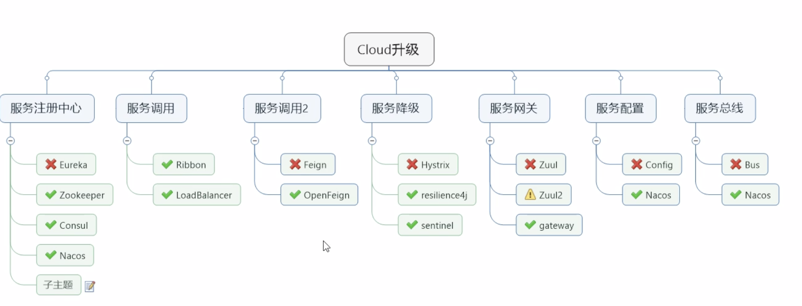
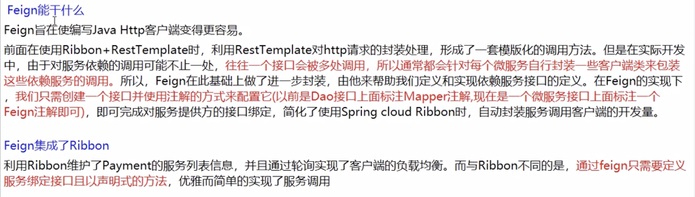
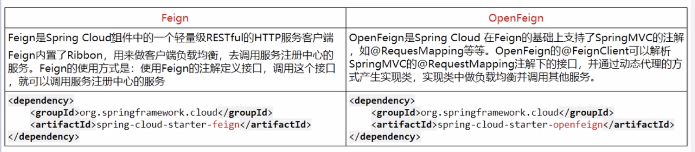
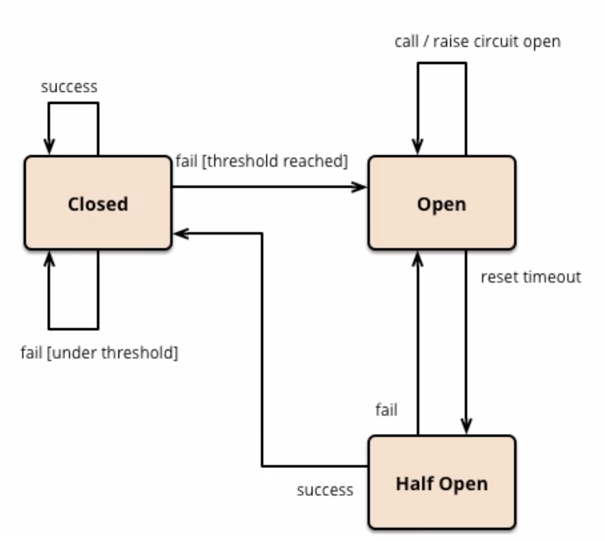

# springCloud学习



## <center>服务调用2</center>

### 1、feign（假装）❌
* 是什么👻：服务提供端的负载均衡，服务调用端只需创建一个借口，添加注解，即可实现

* 为什么要用


### 2、openFeign✅
* 与feign的区别


	#### openFeign使用
	
	1. pmo.xml
		
		```
		 <!--openFeign-->
	        <dependency>
	            <groupId>org.springframework.cloud</groupId>
	            <artifactId>spring-cloud-starter-openfeign</artifactId>
	        </dependency>
		```
	2. application.properties

		```
		spring.main.allow-bean-definition-overriding=true
		```

	
	3. 主启动类
		* 服务调用端 添加@EnableFeignClients
		
			```
			@EnableFeignClients		// 使用该注解启用openFeign
			```
	4. 业务类
		* 定义一个接口
			
			```
			@Component
			@FeignClient(value = "cloud-provider-consul-payment")   //要用OpenFeign负载均衡的服务
			public interface PaymentFeignService {
			
			    @GetMapping("/getport")  // 具体服务的接口
			    String getPort();
			
			    @GetMapping("/timoutTest/{ms}")
			    String timoutTest(@PathVariable("ms")int ms);
			}
			```
	
	#### openFeign服务调用超时设置
	```
	# 修改feign服务调用默认超时时间
	feign.client.config.default.connect-timeout=3000
	feign.client.config.default.read-timeout=3000
	```
	
	#### openFeign服务调用详细日志打印
	1. 日志级别
		* NONE 默认的不显示任何日志
		* BASIC 仅记录请求方法、URL、响应状态码及执行时间
		* HEADERS 显示BASIC和请求和响应头信息
		* FULL 显示HEADERS和请求正文及元数据

	2. 使用
	
		* 编写一个class， 
		
		```
		@Configuration
		public class FeignConfig {
		
		    // 设置openfeign日志级别
		    @Bean
		    Logger.Level feignLoggerLevel(){
		        return Logger.Level.FULL;
		    }
		}
		```
		* application.properties 文件中
		
		```
		# 配置 openFeign日志 以什么级别 监控 哪个接口
logging.level.com.cl.springcloud.service.PaymentFeignService:debug
		```
		
## <center>服务降级与熔断</center>

* 作用，避免因服务调用串中某个服务异常而导致整个系统等待，进而发生雪崩

**重要概念**

* 服务降级 当服务器压力剧增的情况下，根据当前业务情况及流量**对一些服务和页面有策略的降级**，以此释放服务器资源以保证核心任务的正常运行
* 服务熔断 如果某个目标服务调用慢或者有大量超时，此时，**熔断该服务的调用**，对于后续调用请求，不在继续调用目标服务，直接返回，快速释放资源。如果目标服务情况好转则恢复调用
* 服务限流 flowlimit 高并发时，只允许特定数量的请求访问


### 1、Hystrix⚠️
* Hystrix是一个开源库，用于处理分布式系统的**延时**和**容错**
* 断路器熔断器，调用某个服务出故障时，向调用方返回一个符合预期的可处理的备选响应(FallBack)，而不是长时间的等待货抛出调用方无法处理的异常


**Hystrix 使用-服务降级**

* **调用端，配合openFeign**

	1、application.properties 文件
	
	```
	# 启用feign中的服务降级功能
	feign.hystrix.enabled=true
	```
	
	2、主启动类
	
	```
	@EnableHystrix          // 启用Hystrix
	```
	
	3、调用端service接口
	
	```
	@Component
	@FeignClient(value = "cloud-provider-consul-hystrix-payment", fallback = Service15Impl.class) // 使用Feign进行服务调用，并指定fallback实现类，
	public interface Service15 {
	    ...
	}
	
	// Service15Impl继承Service15，并重写其方法，作为fallback方法
	@Component
	public class Service15Impl implements Service15{
		...
   }
	```
	
* **用于被调用端**

	1、主启动类，添加注解
	
	```
	@EnableCircuitBreaker   // 启用服务降级功能
	```

	2、向需要降级的类添加注解
	
	```
	@DefaultProperties(defaultFallback = "c1_defaultFallback") //配置该类的默认全局defaultFallback方法
	```
	
	3、 向需要降级的方法添加注解

	```
	@HystrixCommand //不指定，使用全局默认
	```
	
	4、可单独对某些方法做特定指定
	
	```
	@HystrixCommand(
            fallbackMethod = "getPort2_fallbackMethod",
            commandProperties = {
                    @HystrixProperty(name = "execution.isolation.thread.timeoutInMilliseconds", value = "3000") //若超过3s，则调用fallbackMethod方法
            }
    ) //若该方法故障，用哪个方法catch
	```
	
**Hystrix 使用-服务熔断**

```
	 /**
     * 超时，指定异常处理
     * 服务熔断，在服务降级的基础上，添加降级条件和恢复条件
     * @return
     */
    @RequestMapping("/getPort3/{id}")
    @HystrixCommand(
            fallbackMethod = "getPort3_fallbackMethod",
            commandProperties = {
                    @HystrixProperty(name = "execution.isolation.thread.timeoutInMilliseconds", value = "100"),
                    @HystrixProperty(name = "circuitBreaker.enabled", value = "true"),    //启用熔断功能
                    @HystrixProperty(name = "circuitBreaker.requestVolumeThreshold", value = "10"),    // 检查的请求次数
                    @HystrixProperty(name = "circuitBreaker.sleepWindowInMilliseconds", value = "10000"),    // 时间窗口
                    @HystrixProperty(name = "circuitBreaker.errorThresholdPercentage", value = "60"),    // 失败率达到多少后熔断掉
            }
    ) //若该方法故障，用哪个方法catch
    public String getPort3(@PathVariable("id") Integer id){
        if(id<0){
            throw new RuntimeException("不能为负数");
        }

        return "被调用端--3:"+serverPort + "，线程:" + Thread.currentThread().getName()+", id:"+id;
    }
```


服务降级是预备方案，熔断是有预备方案后设定条件恢复，三种状态


### 2、Resilience4j✅
### 3、Sentinel✅


## <center>服务网关</center>

### 1、Zuul❌
### 2、Zuul2⚠️
### 2、Gateway✅


## <center>服务配置</center>

### 1、Config❌
### 2、Nacos✅


## <center>服务总线</center>

### 1、Bus❌
### 2、Nacos✅